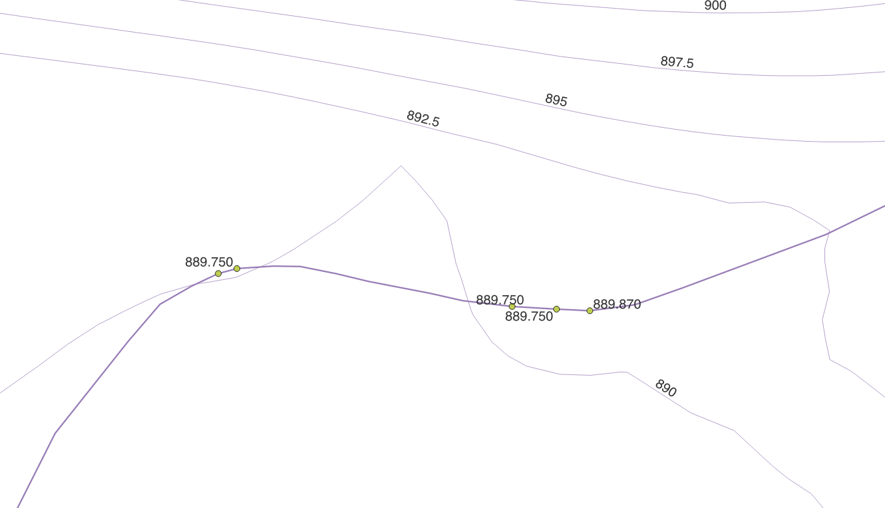
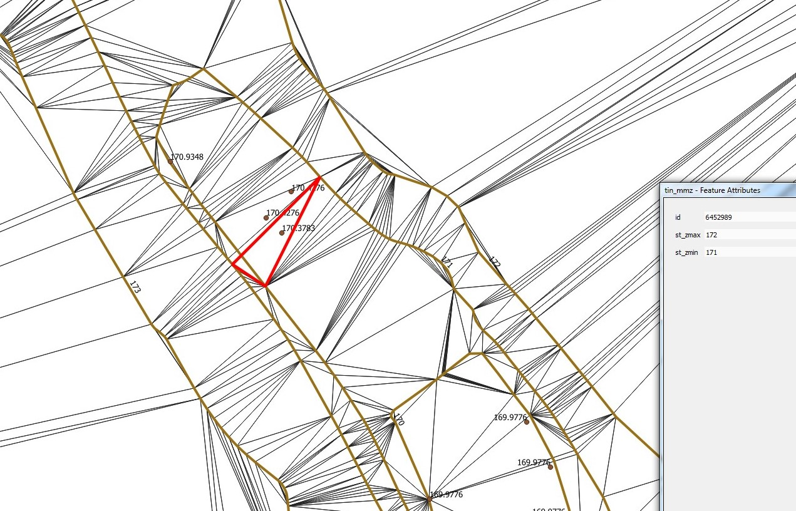
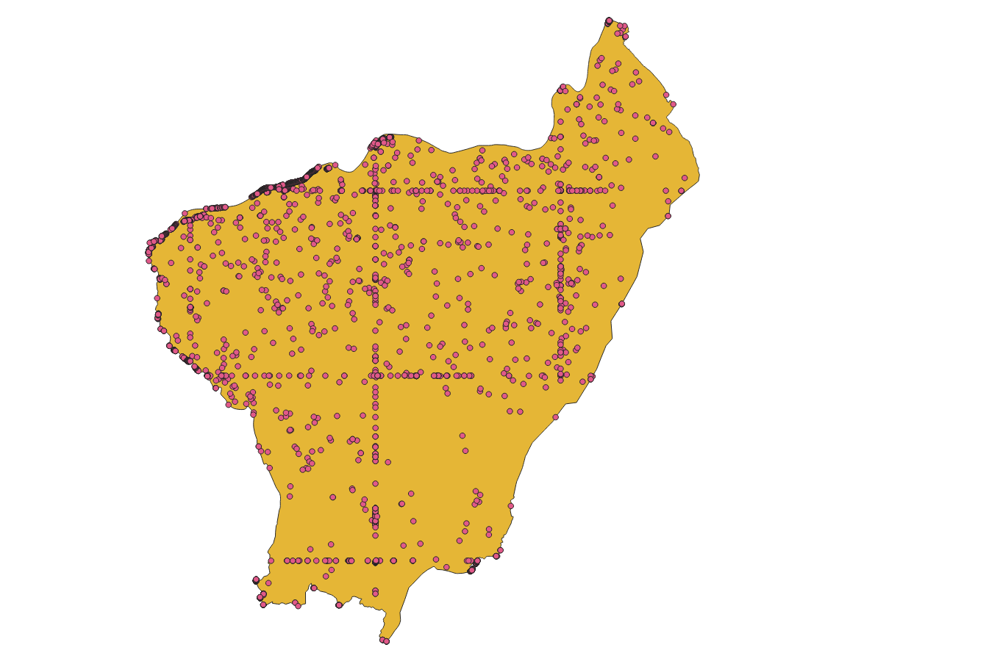

= Notas Info3d

== Introdução

O Info3d é um conjunto de scripts, cujo objectivo é avaliar a coerência dos objectos
tridimensionais tendo como referência as curvas de nível, ou seja, os vértices dos
objectos devem ter a cota entre as curvas de nível inferior e superior, na localização
geográfica onde se encontram.

.Identificação de erros de cota em curso de água

== Médoto utilizado

1. Gerar um TIN com todos os pontos das curvas de nível;
2. Para cada triângulo do TIN são criado dois atributos com a cota máxima e com a cota mínima
dos vértices do triângulo;
3. Os objectos tridimensionais são reduzidos as seus vértices e para cada vértice
é identificado o triângulo do TIN correspondente. Se a cota do vértice estiver entre
a cota mínima e máxima do triângulo, a cota do vértice está correcta.

TIP: Para optimizar a execução do processo, criar o índice GiST para o TIN

== Problemas

* os vértices estão no limite do trabalho e podem não ter nenhum triângulo correspondente;
* os triângulos cruzam uma curva de nível, gerando falsos erros.

.Falso erro devido ao triângulo cruzar ua curva de nível 

WARNING: Os resultados devem ser sempre avaliados à posteriori.

Devido à grande quantidade de pontos das curvas de nível, pode não se conseguir gerar o TIN.
Neste caso, foi desenvolvido um script para criar o TIN seccionado por uma quadrícula quilométrica.
No entanto, os falsos erros gerados nos limites do trabalho vão também aparecer nos limites do
seccionamento.

.Falsos erros nos limites do trabalho ou seccionamento

== Scripts

[cols="1,1,1"]
|===
| *Nome script* | *Descrição* | *Dependências do script*
| curvas_nivel_mediana.sql | Calcula a mediana da cota para cada curva de nível |
| info3d_curvas_nivel.sql | Cota mínima, máxima e o intervalo das curvas de nível | M.View "curvas_nivel_mediana"
| info3d_numero_vertices.sql | Contabilização do número de vértices dos objectos tridimensionais |
| tin_mmz.sql | Geração do TIN com base nos vértices das curvas de nível | Tabela "curva_de_nivel"
| info3d_consistencia_pontos.sql | Avalia as cotas dos vértices dos objectos tridimensionais | Tabela "tin_mmz", "area_trabalho" 
| tin_mmz_particao.sql | Geração do TIN com base nos vértices das curvas de nível com partição quilométrica | Tabela "curva_de_nivel"
|===

